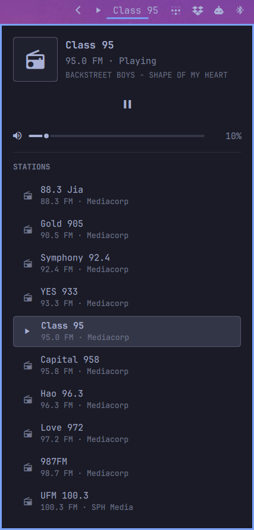

# omarchy-radio-sg

Singapore FM radio for [Omarchy](https://omarchy.org): a bar widget that shows
what's playing, a popup to switch stations, and playback through mpv. No browser,
app or account needed.



- Ten [Mediacorp and SPH stations](#stations), one click apart.
- A popup card in the style of Omarchy's network and audio popups: station, song
  title, play/pause, volume and the station list.
- Scroll the widget for volume, middle-click to pause, right-click to stop.
- An `omarchy-radio` command for terminals and keybindings.

It targets **Omarchy 4's `omarchy-shell`** (the Quickshell bar and plugin system),
not Waybar or Walker.

## Requirements

Omarchy 4 or newer (developed on 4.0.4), plus `mpv`, `socat`, `jq` and `curl`.

## Install

```bash
omarchy plugin add https://github.com/winston/omarchy-radio-sg.git --enable
```

The widget appears on the right of the bar. To move it:
`omarchy bar move winston.radio-sg --section center`.

```bash
omarchy plugin update winston.radio-sg    # get new versions...
omarchy restart shell                     # ...the shell keeps a loaded widget until it restarts
omarchy plugin remove winston.radio-sg --yes
```

Stop any playing station first (right-click the widget), since removing the plugin
does not stop it.

### `omarchy-radio` in a terminal (optional)

The widget runs the command from inside its own folder, so nothing else has to be
installed. To use `omarchy-radio` yourself, or for a keybinding, link it onto your PATH:

```bash
cd ~/.config/omarchy/plugins/winston.radio-sg
./install.sh      # checks the requirements, links ~/.local/bin/omarchy-radio here
./uninstall.sh    # stops playback and removes that link, nothing else
```

The link follows `omarchy plugin update`, and the script never replaces a file it
did not create.

## Using it

| Action | Result |
|---|---|
| Left click | Open or close the popup card |
| Scroll | Volume up or down by 5 |
| Middle click | Pause or resume |
| Right click | Stop |
| Hover | Station, frequency, state, volume and current song |

The card has the station, frequency and current song (when the stream sends one), a
play/pause button, a volume slider, and the station list; click a station to switch.
The play/pause button is disabled while stopped, so start a station from the list.
The widget follows changes made from a terminal within a couple of seconds.

To open the station list as an Omarchy menu from a keybinding (needs the terminal
command above), for example in `~/.config/hypr/bindings.conf`:

```
bindd = SUPER ALT, R, Radio, exec, ~/.local/bin/omarchy-radio pick
```

## Stations

| MHz | Station | Operator | Language | id |
|---|---|---|---|---|
| 88.3 | 88.3 Jia | Mediacorp | English / Mandarin | `jia883` |
| 90.5 | Gold 905 | Mediacorp | English | `gold905` |
| 92.4 | Symphony 92.4 | Mediacorp | Classical | `symphony924` |
| 93.3 | YES 933 | Mediacorp | Mandarin | `yes933` |
| 95.0 | Class 95 | Mediacorp | English | `class95` |
| 95.8 | Capital 958 | Mediacorp | Mandarin | `capital958` |
| 96.3 | Hao 96.3 | Mediacorp | Mandarin | `hao963` |
| 97.2 | Love 972 | Mediacorp | Mandarin | `love972` |
| 98.7 | 987FM | Mediacorp | English | `fm987` |
| 100.3 | UFM 100.3 | SPH Media | Mandarin | `ufm1003` |

These are the stations' public streams, each played and checked with
`omarchy-radio check --play`; the meLISTEN app's private API is not used. Stations
can change or move their streams: if one goes silent, run `omarchy-radio check`
and open an issue. To add one, put an entry in `stations.json` (see
[CONTRIBUTING.md](CONTRIBUTING.md)).

## Command line

```
Usage: omarchy-radio <command> [args]

  list [--json]        Show the stations (--json for a JSON array)
  play <id>            Play a station (switches if one is already playing)
  toggle               Pause or resume
  stop                 Stop playback
  volume <N|+N|-N>     Set or nudge the volume, 0-100
  status               Print the state as one line of JSON
  pick                 Choose a station from the Omarchy menu
  check [--play]       Probe every stream URL; --play also plays 3 s of each

Environment:
  OMARCHY_RADIO_STATIONS   stations.json to use instead of the installed one
  OMARCHY_RADIO_MPV_OPTS   extra mpv options (e.g. --ao=null)
```

`status` prints one line of JSON: `class` (`playing`, `paused` or `stopped`), `text`
and `tooltip` (the same shape Waybar modules use), and while a station is loaded
also `station`, `name`, `freq`, `volume` and, when the stream sends one, `title`.
The last volume is remembered (default 50).

## Troubleshooting

- **The widget does nothing when clicked, or a station won't start.** A required tool
  is probably missing. Run `./install.sh` from the plugin folder; it names anything
  absent.
- **The widget looks unchanged after `omarchy plugin update`.** Run
  `omarchy restart shell`.
- **One station is silent.** Run `omarchy-radio check`; a failing station is named.

## Good to know

Shell plugins run unsandboxed inside `omarchy-shell`. This one is a single QML file
(`RadioWidget.qml`) that only runs `omarchy-radio`, so it is quick to read before you
enable it. It uses the shell's internal UI classes (`PopupCard`, `Button`,
`PanelSlider`, ...), which Omarchy does not document as a stable API, so a future
Omarchy release may need an update here. The plugin folder is the whole repository,
about 1 MB including tests and specs.

## Contributing

Bug reports, station fixes and pull requests are welcome; see
[CONTRIBUTING.md](CONTRIBUTING.md).

## License

[MIT](LICENSE)
